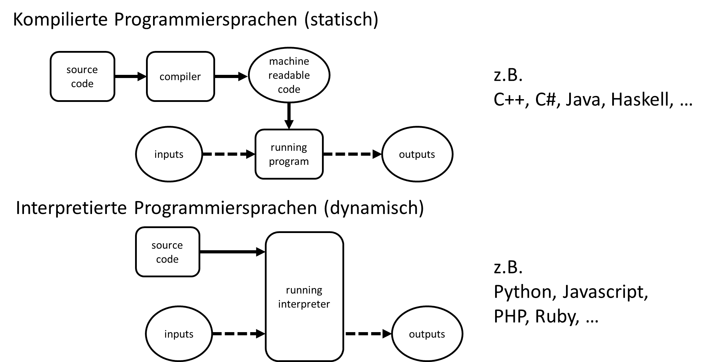

# Programmieren für Data Science und Künstliche Intelligenz

Dies ist ein Skript zur Veranstaltung "Programmieren für Data Science und Künstliche Intelligenz" im Studiengang DAISY an der Hochschule Düsseldorf (HSD). Und wie die meisten Skripte: Work in progress...

## Was ist programmieren und warum brauchen wir das (für Data Science und AI)?

Computer können tolle Sachen, z.B. Milliarden von Berechnungen pro Sekunde verarbeiten oder riesige Mengen an Daten speichern. Kein Wunder also, dass wir diese Fähigkeiten im Bereich Data Science auch nutzen möchten. Natürlich können wir fertige Programme nutzen. In vielen Fällen haben wir aber Aufgaben, die viel zu speziell und schwierig sind. Wir brauchen unsere eigenen Programme, wir müssen **programmieren**.

Es gibt bereits sehr viele Definitionen davon, was programmieren genau ist. Hier können wir es erstmal einfach halten. Im Kern bedeutet Programmieren Aufgaben/Rechenoperationen so zu übersetzten, dass ein Computer sie verstehen kann. In der Regel bedeutet dies, die Aufgaben in einen Programmcode zu überführen, der von einem Computer ausgeführt werden kann.

Warum dies so besonders (besonders schwierig) ist, lieg daran, dass Computer nicht viel verstehen. Ander als bei zwischenmenschlichem Austausch über Sprache können wir keine Vorkenntnisse oder Kontextwissen voraussetzen. Menschliche Sprache bezeichnen wir als **natürlicher Sprache**, diese ist aber oft nicht eindeutig. So kann z.B. *"Ich habe den Mann mit dem Fernrohr gesehen"* zumindest zwei völlig verschiedene Deutungen haben. Ich habe "einen Mann der ein Fernrohr hat" gesehen, oder ich habe "mit Hilfe eines Fernrohrs" einen Mann gesehen. Nur aus dem Kontext können wir diese Fälle unterscheiden. Ein Computer kann dies aber nicht. 

Darum gibt es spezielle **formelle Sprachen** die eindeutig sind, nämlich die **Programmiersprachen**. 

Also:

Programmiersprache muss eindeutig sein, denn der Computer denkt nicht mit und kennt auch keinen Kontext oder Sinn.

Eine **Programmiersprache** ist eine formale Sprache zur Formulierung von Datenstrukturen und Algorithmen/Rechenvorschriften die von einem Computer ausgeführt werden sollen.

Hier im Kurs werden wir das Programmieren mit **Python** lernen. Aber warum Python?

## Python

Python ist eine interpretierte Programmiersprache mit dynamischer Typisierung. Das bedeutet, Code der in Python geschrieben ist muss nicht erst kompiliert werden, sondern kann direkt in einem sogenannten **Interpreter** ausgeführt werden. Das macht eine sehr schnelle, dynamische Entwicklung von kleinen Programmen möglich, bzw. eine sehr schnelle Anpassung von größeren Programmen, was im Bereich Data Science häufig notwendig ist. Man spricht hier auch von einer **Skriptsprache**.

Weiter Vorteile von Python sind, dass Python inzwischen die meistverwendete Programmiersprache im Bereich Data Science und AI ist. Das heißt zum einen, dass es sehr viele Nutzer\*innen gibt die damit arbeiten, so dass es im Internet viele Foren und Tutorials gibt die einem Hilfe und Tipps anbieten können. Zum anderen werden so aber auch viele Bibliotheken bereitgestellt die wir nutzen können. Und zum Schluss bedeutet eine große Community eben auch, dass die Programmiersprache mit der Zeit geht, d.h. regelmäßig erneuert und angepasst wird an neuen Bedingungen (neue Computer Hardware etc.).

Ein weiterer zentraler Punkt der für Python spricht ist, dass Python-Code als gut lesbar gilt. Das ist für Anfänger\*innen wahrscheinlich nicht immer gleich nachvollziehbar den gut lesbar heißt nicht "einfach". Es bedeutet eher, dass Python Code deutlich besser lesbar ist als der Code vieler anderer Sprachen.