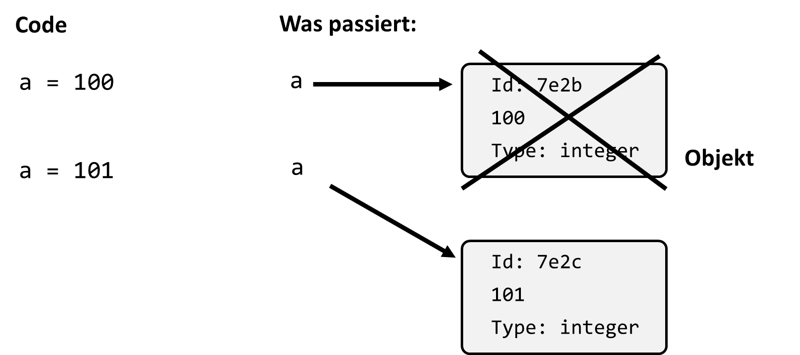
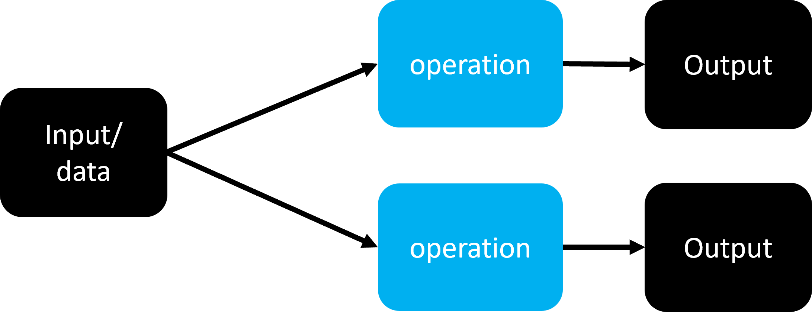
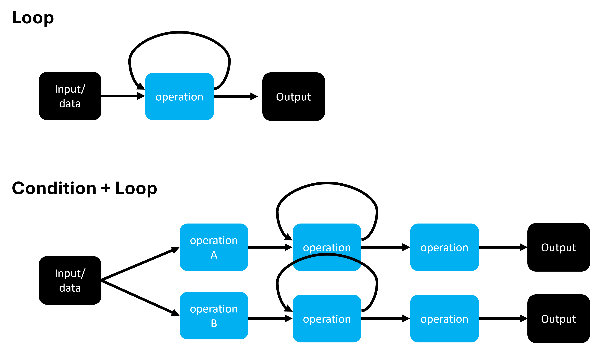

# Kontrollstrukturen und Bedingungen

## Skripte und Programme

Beim Programmieren haben wir es häufig mit mehreren Befehlen zu tun, die aufeinander folgen und zusammen ausgeführt werden. Wenn mehrere solche Befehle untereinander geschrieben und in einer integrierten Entwicklungsumgebung (IDE) wie **Spyder** ausgeführt werden, sprechen wir von einem **Skript** oder einem **Programm**.

### Unterschied zwischen Skript und Programm

Die Begriffe **Skript** und **Programm** werden oft synonym verwendet, jedoch gibt es einen feinen Unterschied:

- **Skript**: Ein einfaches, meist kürzeres Stück Code, das eine spezifische Aufgabe erfüllt. Es wird oft für kleinere, temporäre Aufgaben genutzt.
- **Programm**: Ein größeres und komplexeres Softwareprodukt mit umfangreicheren Funktionen und Strukturen.

In diesem Kurs verwenden wir die Begriffe weitgehend gleichbedeutend.

+ Programm $\approx$ Skript (und Programm > Skript)

**Beispiel für ein kleines Skript:**
```python 
fruit = ["apple", "orange", "banana", "pear"]
juice_choice = 1
ice_choice = 2
print(fruit[juice_choice] + " juice")  # oder: print(f"{fruit[juice_choice]} juice")
print(fruit[ice_choice] + " ice cream")
```
> ### Mini Quiz
> Was gibt dieses Skript aus?
> 1) apple juice, orange ice cream 
> 2) orange juice, banana ice cream
> 3) banana juice, orange ice cream
> 4) Keine Ahnung! Ich müsste raten (will aber nicht)

Mhh. Ziemlich langweiliges Programm. 
Darum fügen wir als nächsten Schritt Benutzerinput hinzu:

### Benutzerinput

Ein häufiges Merkmal interaktiver Programme ist die Möglichkeit, Benutzereingaben zu verarbeiten. In Python nutzen wir hierfür die Funktion `input()`:

<!-- pytest-codeblocks:skip -->

```python
my_str = input("String-Eingabe: ")
print(my_str)  # => gibt den eingegebenen String aus
```

Damit können wir unser vorheriges Früchte-Skript interaktiver gestalten:

<!-- pytest-codeblocks:skip -->

```python
fruit = ["apple", "orange", "banana", "pear"]
print(f"We have: {fruit}")
fruit_choice = input("Please enter your choice: ")
print(f"Here is your {fruit_choice} ice cream!")
```

### Quiz:

> Aber was passiert wenn ich "Ketchup" eingebe?  
> a) Here is your Ketchup ice cream!  
> b) ValueError  
> c) We have no Ketchup ice cream!  

Das führt uns direkt zur Frage: 
Wie überprüfen wir ob es unsere Wahl überhaupt gibt?
Bei den Sequenzen hatten wir schon kurz die Abfrage `xxx in my_list`
Das ist bereits eine Bedingung und die werden in Python auf verschiedene Arten abgefragt:


## Bedingungen

Bedingungen sind eine zentrale Komponente in fast jedem Programm, da sie es uns ermöglichen, Entscheidungen basierend auf dem Zustand von Daten zu treffen. Eine Bedingung ist dabei eine einfache logische Aussage, die entweder **wahr** (`True`) oder **falsch** (`False`) ist.

### Vergleichsoperationen

In Python können verschiedene Vergleichsoperatoren verwendet werden, um Bedingungen zu formulieren:

```python 
9 < 10  # => True

print(3 < 4 < 5)  # => True

print(4.0 == 4)  # => True

print(4.01 == 4)  # => False

"apple" < "banana"  # => True (durch die Reihenfolge im Alphabet sagt Python: a < b)

"apple" != "pear"  # => True
```
### Unterschied zwischen `is` und `==`

Ein häufiger Anfängerfehler ist die Verwechslung zwischen `is` und `==`. Beide Operatoren haben nämlich unterschiedliche Bedeutungen:

- `==` prüft, ob zwei Objekte den **gleichen Wert** haben.
- `is` prüft, ob zwei Objekte auf die **gleiche Speicheradresse** zeigen, also tatsächlich identisch sind.

```python 
a = 12345678
b = 12345678
print(a == b)  # => True
```
Soweit ist das noch keine große Überraschung. Möglicherweise aber doch, dass wir mit `is` nicht das gleiche Ergebnis bekommen: 
<!-- pytest-codeblocks:cont -->

```python 
print(a is b)  # => False
```

Aber warum ist das eigentlich so?
Um das zu verstehen müssen wir noch einmal zurück zum Thema Variablen springen.

Wir hatten schon gesehen, dass Variablen Zuweisungen zu Werten irgendwo im Speicher sind. 

`is` bezieht sich in Python auf eine Abfrage die darauf zielt zu sehen ob es sich um ein und Dasselbe Objekt handelt. Genauer eigentlich, ob zwei Objekte gleich sind und an der selben Speicheradresse hinterlegt sind.
Dies kann auch über `id()` (von identity) ausgegeben werden:
<!-- pytest-codeblocks:cont -->

```python 
print(id(a))
print(id(b))
print(id(a) != id(b))  # => True
```


In der Praxis werden wir aber nur sehr selten mit `is` Abfragen in diesem Kontext zu tun haben. Doch zu verstehen was "hinter der Bühne" abläuft hilft auch bei einer anderen noch viel wichtigeren Unterscheidung die wir in Python berücksichtigen müssen. In Python unterscheiden wir Datentypen nach veränderbar (**mutable**) und unveränderbar (**immutable**). 

**Veränderbare Datentypen** erlauben es, dass deren Werte dynamisch verändert werden können. Zu dieser Kategorie zählen Listen, Sets (kommen später) und Dictionaries (kommen später).

**Unveränderbare Datentypen** erlaben es nicht, dass die Werte nachträglich geändert werden. Dazu zählen  Zahlen (int, float), Boolean, String und Tuples.

Beispiel:

```python
fruits = ["apple", "banana", "mango"]
print(fruits[-1])  # -> mango

# Beim Datentyp list können wir Elemente verändern:
fruits[-1] = "orange"
print(fruits[-1])  # -> orange


# Beim Datentyp Tuple geht das nicht
fruits = ("apple", "banana", "mango")
print(fruits[-1])  # -> mango

fruit[-1] = "orange"  # -> TypeError
```

Natürlich können wir aber auch Variablen mit unveränderbaren Datentypen beliebig neu zuweisen. Dabei wird aber immer auch ein neues Objekt im Speicher erzeugt.

#### Achtung: lazy Python...

Bei "kleinen" Objekten kann es allerdings passieren, dass diese doch die gleiche "identity" bekommen. Das macht es leider noch unübersichtlicher: 

```python 
a = "looks like the same string"
b = "looks like the same string"
print(a is b)  # => True or False (depends on where it is run...)

a = 5
b = 5
a is b  # => True
```
aber:
```python 
a = 30019
b = 30019
a is b  # => False !?! Also besser nicht so benutzen...
```
**Abschließendes zum Thema `is` vs `==`:**
+ Alle Datentypen ausser Zahlen, Strings, Bool und None erzeugen neue Objekte
+ `is` benutzen um nach identischen Objekten zu fragen
+ `==` benutzen um nach gleichem "Inhalt" zu fragen
Beispiele wofür es gedacht ist:

```python 
a = [1, 2]
b = [1, 2]
print(a is b)  # => False
```
oder:

```python 
a = [1, 2, 3, 4]
b = a
print(a is b)  # => True

b[0] = 77
print(a)  # => [77, 2, 3, 4]
```


---
### Logische Operatoren

In Python gibt es die logischen Operatoren `and`, `or`, und `not`, die zur Kombination von Bedingungen verwendet werden können.
Hier geht es nicht darum was wir im Alltag als "logisch" bezeichnen, sondern um klassische Logik, und da gilt: 

```python
True and False  # => False
True or False  # => True
```

Hier mal ein konkretes Beispiel: 

```python 
a = 4
a < 0 or a > 3  # => True
```
Besser lesbar wird es manchmal durch Klammern.

```python
a = 4
(a < 0) or (a > 3)  # => True
```

Logische Ausdrücke, etwa mit `or` können auch zu längeren Abfragen kombiniert werden:

```python 
s = "ja"
(s == "Ja") or (s == "JA") or (s == "ja")  # => True
```
***Vorsicht:*** Solche verschachtelteren Logik-Abfragen können schnell kompliziert werden!

---

### Bedingte Anweisungen (`if`, `else`, `elif`)

Wofür jetzt das Ganze? Was ist so toll an den Bedingungen?
Konditionen und logische Abfragen sind essentiell wenn es um Programmflüsse geht. Mit bedingten Anweisungen können wir unseren Programmen "Entscheidungsfindung" ermöglichen. 



Eine typische `if`-Anweisung sieht so aus:

```python 
number = 0.01
if number >= 0:
    print(f"{number} ist positiv.")
```

Für komplexere Entscheidungen kann eine `if-else`- oder `if-elif-else`-Struktur verwendet werden.
Zuerst ein Beispiel mit `if-else`:

```python 
number = 0.01   

if number >= 0:
    print(f"{number} ist eine positive Zahl.")
else:
    print(f"{number} ist eine negative Zahl.")
    
```

Dann eines mit `if-elif-else`:

```python 
number = 0.01

if number > 0:
    print(f"{number} ist eine positive Zahl.")
elif number < 0:
    print(f"{number} ist eine negative Zahl.") 
else:
    print(f"{number} müsste 0 sein?")
```
Damit kann man ewig lange Abfragen bauen, zum Beispiel sowas: 
<!-- pytest-codeblocks:skip -->

```python 
angebot = float(input("Dein Angebot: "))
if angebot <= 0:
    print("Richtig witzig, danke.")
elif angebot < 10:
    print("Lächerlich!")
elif angebot < 20:
    print("Nein, lieber nicht.")
elif angebot < 25:
    print("Das kommt schon in die Nähe...")
elif angebot < 30:
    print("Mmhhh. OK. Weil du's bist.")
elif angebot < 40:
    print("Ok. Deal.")
elif angebot < 100:
    print("Deal. Eine Freude mit dir Geschäfte zu machen.")
else:
    print("Moment... irgendwas stimmt hier nicht...")
```

***Wichtig:*** In Python wird mit Einrückungen gearbeitet! Andere Sprachen nutzen dafür oft Klammern.
Die Art der Einrückungen kann im Prinzip frei gewählt werden, sie muss nur Konsistent sein. Meistens werden als Standard aber 4 Leerzeichen gewählt.


Als abschließendes Beispiel dazu können wir nun das Früchte-Skript von vorhin noch einmal überarbeiten.
<!-- pytest-codeblocks:skip -->


```python 
fruit = ["apple", "mango", "banana", "pear"]
print(f"We have: {fruit}")
fruit_choice = input("Please enter your choice: ")
if fruit_choice in fruit:
    print(f"Here is your {fruit_choice} ice cream!")
else:
    print(f"{fruit_choice}? We don't have it.")
```

## Schleifen (*loops*) 
Schleifen sind eine weitere grundlegende Kontrollstruktur in Python. Sie ermöglichen es, eine bestimmte Codefolge wiederholt auszuführen, solange eine Bedingung erfüllt ist. Und natürlich können Schleifen auch mit den Verzweigungen die wir gerade gesehen haben kombiniert werden. Damit lassen sich deutlich komplexere Programmabläufe erstellen.



### While-Schleife (*while loop*)

Eine `while`-Schleife wiederholt den Code, solange ein bestimmter Wert, oder eine Bedingung, wahr ist (`True`). In Python sieht deren Codestruktur aus wie folgt:

<!-- pytest-codeblocks:skip -->

```python
while True:
    # do something
    
# Code here is only executed after the while loop
```

Ein kleines Beispiel:

```python 
x = 2
while x < 1000:
    x = x**2
    print(x)
```
Anderer Startwert:
```python 
x = 1.0000002
while x < 1000:
    x = x**2
    print(x)
```
**Vorsicht:** While loops können auch endlos laufen!
=> Mit Ctrl+C kommt ihr da aber wieder raus :)
<!-- pytest-codeblocks:skip -->

```python 
x = 0.9
while x < 1000:
    x = x**2
    # print(x) 
```
Ein `while` Loop lässt sich auch mit `else` kombinieren:
```python 
x = 2
while x < 100:
    x = x + 2 * x
    print(x)
else:
    print("Fertsch!")
    
```
Das ist aber (in diesem Fall) vom Ablauf des Programmes her nichts anderes als folgendes:
```python 
x = 2
while x < 100:
    x = x + 2 * x
    print(x)
print("Fertsch!")
```
#### break!

Wie wir schon gesehen haben können while-Schleifen auch endlos laufen (was eigentlich nie gewünscht ist). Denn die while-Schleife läuft solange die angegebene Bedingung `True` ist. Sobald die Bedingung `False` wird hört die Schleife auf.
Es gibt aber noch eine zweite Möglichkeit eine while-Schleife zu beenden und zwar mit `break`

```python
x = 5
dx = 0.9
while x < 100:
    x = x * dx
    print(x)
    if x < 0.5:
        print("x is too small")
        break
```


### For loops (For Schleifen)

In der Praxis werden in Python sogenannte "for loops" deutlich häufiger als "while loops" genutzt. 
Vom Prinzip her sieht das Ganze so aus.

<!-- pytest-codeblocks:skip -->

```python 
for expression in iterable:
    # code
else:
    # some other code
```
Wir lassen den `else` Teil erstmal weg. 
Im Klartext macht ein `for` loop das Folgende. Der Loop läuft einmal durch alle Elemente aus `iterable`. Ein Beispiel:

```python 
for antwort in ["ja", "nee", "vielleicht", "weiss nicht"]:
    print(f"Ich sag mal...{antwort}")
```
Das Funktioniert mit jeder Python Sequenz auf diese Art:
```python 
for char in "That's a string and full of letters.":
    print(char)

for x in [0, 2, 19, 3]:
    print(x + 1)
```
### Best friends: `range` and `for`
Oft möchten wir eine Programmteil n-mal laufen lassen. Dafür nutzt man in Python `range`. `range` ist ein "generator", einen Funktionstyp den wir später noch genauer besprechen. An dieser Stelle reicht es zu wissen, dass es eine Funktion ist, die Werte erst ausgibt, wenn sie ausgelesen werden.
`range` generiert Integer ein einem gewünschten Intervall und Abstand

```python 
print(list(range(5)))  # => [0, 1, 2, 3, 4]
print(list(range(4, 8)))  # => [4, 5, 6, 7]
print(list(range(10, 30, 4)))  # => [10, 14, 18, 22, 26]
```
> ### Mini Quiz
> Was gibt `list(range(-3, 3)` aus?  
> a) [-3, 0, 3]  
> b) [-3, -2, -1, 0, 1, 2, 3]  
> c) [-3, -2, -1, 0, 1, 2]  


OK, zurück zum eigentlichen Einsatz, dem `for` loop:
```python 
for i in range(5):
    print(i)    
```
Tada!
Falls die Zahl `i` innerhalb der Schleife nicht verwendet wird kann sie auch
weggelassen werden:
```python 
for _ in range(3):
    print("Dreimal: Ja!")
```
Falls man einen Zähler und ein Element aus einer Sequenz benötigt, gibt es
die Alternative `enumerate` statt `range`:
```python 
fruits = ["apple", "mango", "banana", "pear"]
for i, fruit in enumerate(fruits):
    print(f"{i + 1}. {fruit}")
```
### Zwei weitere wichtige Optionen in Loops: `break` und `continue`
`break` ermöglicht es aus Loops vorzeitig auszubrechen. Zum Beispiel hier:

```python 
for zeichen in "Ja genau. Dies ist ein string.":
    if zeichen == ".":
        print("Punkt gefunden!")
        break
    # Hier kommt man nur hin wenn break nicht ausgeführt wurde
    print(zeichen)

print("Fertig.")
```
`continue` ist dagegen die Aufforderung den laufenden Zyklus des Loops
zu verlassen, aber dann mit dem Loop fortzufahren.

```python 
zahlen = [2, 3, 5, 9, 557, 1232, 233358]
for zahl in zahlen:
    if zahl%3 != 0:
        continue
    # Hier kommt man nur hin wenn continue nicht ausgeführt wurde
    print(f"{zahl} ist durch 3 teilbar!")
```
Beide Befehle (`continue` und `break`) können genauso auch in `while` Schleifen
eingesetzt werden.

### List comprehension !
In Python gibt es noch eine andere, sehr kompakte Art einen Loop zu bauen. Das ist die sogenannte "List comprehension".
```python 
my_list = [1, 2, 10]
new_list = [x**2 for x in my_list]
print(new_list)
```
Als `for` loop wäre das ganze deutlich länger:
```python 
my_list = [1, 2, 10]
new_list = []  # leere Liste
for i in my_list:
    new_list.append(i ** 2)
print(new_list)
```
Routinierte Python-Programmierer*Innen nutzten gerne und oft die list comprehension. Das verkürzt den Code eines Programmes oft deutlich. Allerdings sollte man darauf achten das *weniger Code* nicht automatisch *besserer Code* bedeutet! Vor allem bei komplizierteren, verschachtelten Beispielen sind list comprehensions oft sehr schwer zu lesen. D.h. auch wenn etwas "nur" eine Zeile Code benötigt, es aber Minuten dauert um zu verstehen was dort geschieht, ist ein normaler `for`-loop vielleicht die bessere Wahl.

> ### Quiz!
>
> Was gibt die folgende List comprehension aus?  
> `print([s[0] for s in ["eins", "zwei", "drei"]])  
> a) eins  
> b) eins, zwei, drei  
> c) e, z, d  
> d) 0, 0, 0  
