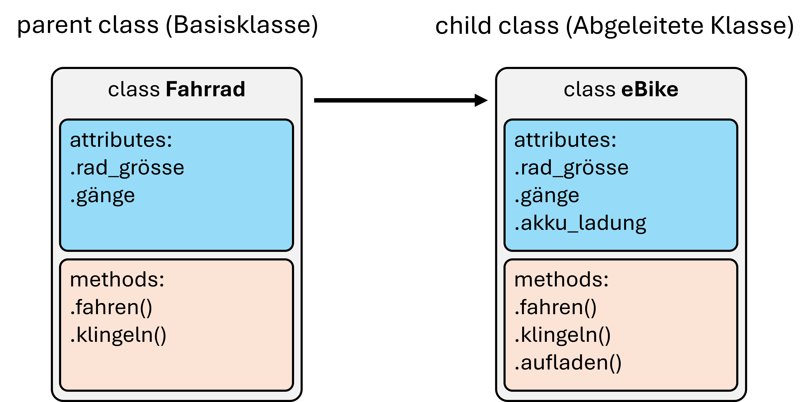

# Objektorientierte Programmierung in Python

Wir haben bisher gesehen wie wir Klassen in Python definieren und wie wir damit Objekte erzeugen. Wir haben gesehen wie wir Methoden definieren und Attribute zuweisen und auch wie wir die `__init__()`-Methode einsetzten können.

## Klasse vs. Objekt/Instanz

Zu Beginn gibt es bei der OOP (Objektorientierten Programmierung) oft einige Verwirrungen. Nicht selten geht es dabei auch um den fundamentalen Unterschied zwischen Klasse und dem erzeugten Objekt.

In den meisten Fällen, und allen die wir bisher besprochen haben, können wir die Klasse als eine abstrakte Vorlage für die später damit erzeugten Objekte sehen. D.h. die Klasse definiert, welche Eigenschaften (Attribute) und Fähigkeiten (Methoden) Objekte haben sollen.

Über `class XYZ:` wird so eine abstrakte Klasse *definiert*. Der eigentliche Code darin wird aber erst ausführbar, wenn ein Objekt der Klasse erzeugt wird (`a = XZY()`). Attribute die erst im Konstruktor (`__init__()`) gesetzt werden, werden dabei erst erzeugt wenn auch ein Objekt der Klasse erzeugt wird. Darum funktioniert auch der folgende Code nicht:

<!-- pytest-codeblocks:expect-error -->

```python
class DoNothing:
    def __init__(self):
        self.chill = True

print(DoNothing.chill)  # => AttributeError: type object 'DoNothing' has no attribute 'chill'
```

Das geht also nicht, sondern erst wenn ein Objekt erstellt wird:
<!-- pytest-codeblocks:cont -->

```python
a = DoNothing()
print(a.chill) # => True
```

### Was ist `self`?

Das Argument `self` bezieht sich auf die jeweilige Instanz einer Klasse, d.h. das Objekt selbst. Code in dem `self` auftaucht, kann also immer nur von erzeugten Objekten aus sinnvoll ausgeführt werden. 
(Übrigens: Statt self könnte auch ein abweichender Name verwendet werden, aber da `self` überall der Standard ist werden wir davon keinen Gebrauch machen.)

Was ist aber mit Code, z.B. zugewiesenen Attributen, die ohne `self` auskommen?

Ein Beispiel wäre sowas:

```python
class MyClass:
    class_value = 111
    def __init__(self):
        self.instance_value = 2222

# Erst die Klasse direkt nutzen
print(MyClass.class_value)  # --> 111
# print(MyClass.instance_value)  # --> AttributeError

# Jetzt eine Instanz der Klasse erzeugen und nutzen
my_object = MyClass()
print(my_object.class_value)
print(my_object.instance_value)
```

Wir sprechen hier auch von **Klassenattributen** (hier: `.class_value`) und **Instanzattributen** (hier: `.instance_value`). Über erzeugte Objekte sind bei Typen von Attributen verfügbar, in der Klasse selbst sind aber die Instanzattribute nicht vorhanden.

Wie sieht es dann mit den Methoden aus? 

Auch da haben wir bisher typischerweise mit `self` gearbeitet. Und entsprechen sprechen wir hier auch von **Instanzmethoden** (*instance methods*). Diese sind ebenfalls nur über erzeugte Objekte zugänglich.

Beispiel:

<!-- pytest-codeblocks:expect-error -->

```python
class SuperPrint:
    def upper_print(self, text):
        print(text.upper())

# Instanzmethode kann nicht über Klasse aufgerufen werden:
SuperPrint.upper_print("mein text soll größer werden")  # => TypeError

# Und die Methode ist auch nicht (wie eine Funktion) global verfügbar:
upper_print("mein text soll grösser werden")  # => NameError: name 'upper_print' is not defined
```

Erst wenn ein Objekt der Klasse SuperPrint erzeugt wird, kann damit die Methode `upper_print()` ausgeführt werden. Die Methode gehört also zu allen Objekten der Klasse `SuperPrint` und ist ansonsten nicht verfügbar, weder über die Klasse selbst, noch global wie bei einer Funktion.

<!-- pytest-codeblocks:cont -->

```python
printer = SuperPrint()
printer.upper_print("mein text soll grösser werden")
```

### Klassenmethoden (class methods)

Wir haben gerade gesehen, dass die Methoden die wir bisher programmiert haben (mit `self`) sich nur über erzeugte Objekte ausführen lassen (**Instanzmethode**). Aber es gibt auch **Klassenmethoden** die über die Klasse aufrufbar sind.

Klassenmethoden werden in Python üblicherweise explizit als solche ausgewiesen über einen sogenannten "Decorator". Was das genau ist, werden wir an dieser Stelle aber noch nicht behandeln (kommt später).  Das SuperPrint Beispiele sähe damit wie folgt aus (`@classmethod` ist dabei der erwähnte Decorator):

```python
class SuperPrint:
    @classmethod
    def upper_print(cls, text):
        print(text.upper())

SuperPrint.upper_print("mein text soll größer werden")
```

Auch hier gibt es ein spezielles erstes Argument das wir nun aber nicht `self` sondern `cls` (für class) nennen.

Jetzt die Frage: Wann nutzen wir Klassenmethoden?

Wie schon erwähnt, werden wir überwiegend mit Instanzmethoden arbeiten. Aber es gibt auch Fälle in denen Klassenmethoden sinnvoll sind. Ein Beispiel könnte eine Erweiterung der `Point` Klasse sein, die wir schon einmal erstellt hatten. Stellen wir uns nun vor, wir wollen eine neue Methode hinzufügen die ein Point-Objekt mit zufälliger Position erzeugt, etwas `create_random_point()`. Wenn wir diese Methode aber wie bisher mit `self` definieren können wir sie ja nur über erzeugte Objekte aufrufen. Das würde dann bedeutet wir müssen ein Point-Objekt erzeugen um damit dann ein neues Point-Objekt erstellen zu können... nicht sehr intuitiv. An einer solchen Stelle ist eine Klassenmethode die bessere Wahl:

```python
import math
import random


class Point:
    def __init__(self, x, y):
        self.x = x
        self.y = y

    def position(self):
        print(self.x, self.y)

    def center_distance(self):
        return math.sqrt(self.x ** 2 + self.y ** 2)

    @classmethod
    def create_random_point(cls):
        return Point(random.random(), random.random())


random_point = Point.create_random_point()
random_point.position()
```

Da die Klassenmethode in diesem Fall eine Instanz erzeugt spricht man auch von einer **factory method**.


---


Neben den bisher besprochene Verbindung von Methoden und Attributen, gibt es noch viele andere Möglichkeiten durch die Objektorientierte Programmierung. Eine besonders häufig genannte ist die sogenannte **Vererbung**.

## Vererbung (inheritance)

Klassen können anderen Klassen ihre Eigenschaften vererben. Das ist in der Praxis tatsächlich an manchen Stellen sehr nützlich! 

Im Fahrrad-Beispiel aus dem vorherigen Kapitel wäre das in etwa eine Unterart von Fahrrad die aber die Kerneigenschaften von Fahrrad übernehmen (also "erben") soll, z.B. ein eBike.


Wir können uns das aber auch direkt an einem einfachen Code-Beispiel anschauen. Wir haben gerade Punkte definiert (`Point`-Klasse) und möchten jetzt auch andere geometrische Typen entwerfen. Dann müssen wir nicht unbedingt alles neu definieren, sondern es geht auch das Folgende:

```python
# Schon oben ausgeführt:
import math

class Point:
    def __init__(self, x, y):
        self.x = x
        self.y = y

    def position(self):
        print(self.x, self.y)

    def center_distance(self):
        return math.sqrt(self.x ** 2 + self.y ** 2)
    
    def distance_to_point(self, point):
        dist_x = self.x - point.x
        dist_y = self.y - point.y
        return math.sqrt(dist_x ** 2 + dist_y ** 2)
    
# Neue Klasse definieren:    
class Circle(Point):
    def __init__(self, x, y, radius):
        self.x = x
        self.y = y
        self.radius = radius

a = Circle(11, 2, 5)
print(a.center_distance())  # => 11.180339887498949
```

Ohne das wir eine Methode neu definiert haben, funktioniert schon der Aufruf `.center_distance()`!

Das liegt daran, dass wir hier gesagt haben das `Circle` auf die Klasse `Point`zurückgreifen darf. Man spricht hier von "Vererbung" und demensprechend auch davon, dass `Circle` das Kind (*child*) ist von `Point`. 

`Point` wird die "Basisklasse" oder auch Super-, Ober- oder Elternklasse genannt (*parent class*), während `Circle` in diesem Beispiel die "abgeleitete Klasse" oder auch Sub-, Unter-, oder Kindklasse heißt (*child class*).

Es lassen sich damit auch interessante Zugehörigkeits- oder Type-Abfragen machen. So ist `a` im oberen Beispiel ein Objekt der Klasse `Circle`, aber ist eben auch auf eine Art verbunden mit der *parent class*  `Point`. In Python können solche Zugehörigkeiten abgefragt werden mit `isinstance()`:

<!-- pytest-codeblocks:cont -->

```python
print(isinstance(a, Point))  # => True
print(isinstance(a, Circle))  # => True
```

### super()

Im Beispiel oben haben wir in der abgeleiteten Klasse (`Circle`) die komplette init-Methode überschrieben durch eine neue. Das wirkt vielleicht -zu recht- etwas merkwürdig, denn die Methoden sind sich eigentlich sehr ähnlich und ein größerer Teil des Codes kommt somit mehrfach vor.

Es gibt auch noch eine andere Möglichkeit den Konstruktor (`__init__()`) anzupassen und gleichzeitig auf den Konstruktor der *parent class* zuzugreifen und zwar mit `super()`:

<!-- pytest-codeblocks:cont -->

```python
class Circle(Point):
    def __init__(self, x, y, radius):
        super().__init__(x, y)  # damit wird der Konstruktor der parent class ausgeführt
        self.radius = radius

a = Circle(11, 2, 5)
print(a.center_distance())
```

V.a. wenn der Konstruktor einer Klasse viele Parameter setzt und/oder weitere Schritte enthält macht der Einsatz von `super()`an dieser Stelle den Code einfacher.

## Umfangreichers Beispiel (Übung --> Spiel Pig)

Ein weiterer wichtiger Punkt den wir in der Übung angefangen haben, war ein Gefühl dafür zu bekommen wann, warum, und wie man Klassen überhaupt einsetzt. Als Beispiel dafür haben wir angefangen ein erstes kleines Spiel zu programmieren: Pig (oder "Böse Eins"). Die Spielregeln sind einfach:

Spielregeln:

* 2 Spieler*Innen spielen gegeneinander und wechseln sich ab. Beide starten mit 0 Punkten.
* Spieler\*In der/die an der Reihe ist würfelt mit 1 Würfel (Zufallszahl -> 1-6). Die Ergebnisse werden zusammengezählt, bis Spieler\*In beschließt zu stoppen, oder: bis eine Eins gewürfelt wird. Wurde gestoppt ohne das eine Eins kam, dann werden die Punkte alle dazugezählt. Wurde eine Eins gewürfelt,  gibt es keine Punkte dazu.
* Wer als erstes 100 Punkte erreicht, gewinnt.

Um dieses Spiel objektorientiert zu programmieren, muss erst überlegt werden welche Klassen es denn geben soll/muss. Typischerweise orientiert man sich bei der Suche danach an den wichtigsten Gegenständen/Elementen/Akteuren. In diesem Beispiel würden z.B. folgende Klassen Sinn machen:

* Würfel --> class Dice
* Spieler*In --> class Player
* Spiel/Spielregeln/Spielablauf/Spielmechanik --> class PigGame

Als nächstes muss geschaut werden, welche Eigenschaften (Attribute) und Handlungen/Möglichkeiten (Methoden) die Klassen bräuchten. Am einfachsten dabei ist die Klasse `Dice`, den die muss v.a. würfeln können was ja nichts anderes ist als Zufallszahlen von 1 bis 6 zu liefern.

```python
from random import randint


class Dice:
    def __init__(self, sides=6):
        self.sides = sides

    def roll(self):
        return randint(1, self.sides)
```

Wie oben bereits erwähnt, macht diese Klasse aber erstmal nichts. Dazu muss erst ein `Dice`-Objekt ereugt werden.

<!-- pytest-codeblocks:cont -->

```python
dice = Dice()
print(dice.roll())
```

Die zweite Klasse ist dann `Player` und das wird schon deutlich schwieriger!

```python
class Player:
    def __init__(self, name):
        self.score = 0
        self.name = name

    def move(self, dice):
        print(f"\n{self.name}'s turn -----------")
        print(f"Current score: {self.score} ---------")
        additional_score = 0
        while True:
            roll = dice.roll()
            additional_score += roll
            print(f"{self.name} got a {roll}! Total={additional_score}")
            if roll == 1:
                break
            user_choice = input("Continue (y/n)? >>> ")
            if user_choice == "n":
                self.score += additional_score
                print(f"+ {additional_score} --> {self.score}")
                break
```

Jede(r) Spieler*In hat zwei Eigenschaften: einen Namen (`.name`) und einen Punktestand (`.score`). Dazu kommt eine Methode um einen Spielzug zu machen (`.make_move()`). Diese Methode haben wir in der Übung erstellt und getestet. Ein sehr wichtiges Element vom Objektorientiertem Ansatz kann man an dieser Stelle schon gut sehen: Objekte werden an andere Objekte weiter gegeben. Es muss also erstmal ein Würfel-Objekt erstellt werden damit ein `Player`-Objekt spielen kann!

<!-- pytest-codeblocks:skip -->

```python
player1 = Player("Helmut")
player2 = Player("Sandra")
dice = Dice()

player1.make_move(dice)
player2.make_move(dice)
```

Also: Genauso wie ich in einem echten Würfelspiel den Würfel (ein Objekt) an eine(n) Spieler*In geben würde, wird auch hier das Objekt `Dice` an `Player` gegeben. Und zwar nicht die als feste Eigenschaft (also: Attribut), sondern nur als Argument in der Methode `.make_move()`. Vielleicht erscheint das jetzt erstmal etwas seltsam. Immerhin ist ein Würfelwurf auch nichts besonders kompliziertes und ich könnte ja auch einfach eine Funktion dafür schreiben oder sogar nur direkt `random.randint(1, 6)` aufrufen. 

Der Hauptvorteil ist, dass klar strukturiert ist welche Eigenschaften wo festgelegt werden. Nämlich immer nur bei den dazugehörigen Objekten. Sprich: Wenn `player1` dran ist, geht der Würfel an die entprechende `make_move()`Methode, usw.

Wenn das Spiel jetzt mit einem anderen Würfel stattfinden soll, muss nur der Würfel verändert werden, z.B. so:

<!-- pytest-codeblocks:skip -->

```python
player1 = Player("Helmut")
player2 = Player("Sandra")
dice = Dice(sides=4)

player1.make_move(dice)
player2.make_move(dice)
```

---

Jetzt kommen wir zu noch ein paar weiteren Eigenschaften und Möglichkeiten der Objektorientierten Programmierung.

## Datenkapselung

Datenkapselung ist im Prinzip nichts anderes als der Schutz von Daten (Attributen) vor unmittelbarem Zugriff. Wir haben schon gesehen, dass Attribute auch einfach eingesehen und geändert werden können, z.B. `point1.x = 5`. Aber *idealerweise* versuchen die meisten Programmieren*Innen ihre Klassen so zu designen, dass Attribute v.a. über sogennante "Getter" und "Setter"-Methoden aufgerufen werden. 

### Public -> Protected -> Private

Eine wichtige Eigenschaft von Klassen, auch im Zusammenhang mit der Datenabstraktion, ist die Möglichkeit die Zugriffsrechte auf die Attribute festzulegen. Python ist hierbei deutlich weniger strikt als viele andere Programmiersprachen, d.h. wir erstellen jetzt gleich keine high-security Programme. Aber es gibt auch in Python die wichtige Unterscheidung zwischen frei zugänglichen (public), geschützten (protected) und unzugänglichen (private) Attributen.

Python hat hier also drei Stufen:

• name (**Public**): 
 Attribut ohne führende Unterstriche; sind innerhalb einer Klasse und auch von außen les- und schreibbar.

• _name (**Protected**): 
 Man kann zwar von außen lesend und schreibend zugreifen, der/die Entwickler*In macht aber klar das man diese Attribute so nicht benutzen sollte; Protected-Attribute sind beim Importieren wichtig.

• __name (**Private**): 
 Sind von außen weder sichtbar noch benutzbar 

<!-- pytest-codeblocks:expect-error -->

```python
class MagicSpell:
    name = "Expecto Patronum"
    _book = "Magic Spells IV"
    __explanation = "Here is how it works..."

spell = MagicSpell()

print(spell.name)  # => Expecto Patronum
print(spell._book)  # => Magic Spells IV
print(spell.__explanation)  # => AttributeError: 'Spell' object has no attribute '__explanation'

```

Hier ist also zu sehen, dass die *protected attributes*  durchaus noch ganz normal eingesehen werden können! Bei Python ist der eine Unterstrich vor einem Attributsname eher als ein Hinweis an Nutzer\*Innen und v.a. Entwickler\*Innen zu verstehen, diese Variablen nicht einfach zu verändern. Das entspricht in etwa einem "Zutritt auf eigene Gefahr"-Schild.

Die Attribute mit Status *private* geben aber einen `AttributeError`, d.h. diese können tatsächlich nicht mehr wie zuvor aufgerufen und verändert werden.

Das gleiche geht natürlich auch mit einem Konstruktor:

<!-- pytest-codeblocks:expect-error -->

```python
class MagicSpell:
    def __init__(self, name, book, explanation):
        self.name = name
        self._book = book
        self.__explanation = explanation

spell = MagicSpell("Expecto Patronum",
                   "Magic Spells IV",
                   "Here is how it works...")

print(spell.name)  # => Expecto Patronum
print(spell._book)  # => Magic Spells IV
print(spell.__explanation)  # => AttributeError
```


Bevor jemand jetzt aber auf die Idee kommt, damit sensible Daten zu schützen: Einen richtig strengen Schutz der Attribute gibt es bei Python nicht! Der Zugang wird nur bewusst erschwert. Theoretisch können die verstecken Attribute aber noch immer eingesehen werden mit:

<!-- pytest-codeblocks:cont -->

```python
print(spell._MagicSpell__explanation)  # nur zur Info, bitte diesen Weg nicht in Programmen nutzen!
```

Oder, noch einfacher, einfach mal im "Variable Explorer" in Spyder öffnen...

Als kurzes Beispiel einmal den Fall, dass wir nicht wollen das Nutzer\*Innen .x oder .y eines `Point`-Objekts einfach ändern können:

```python
class Point:
    def __init__(self, x, y):
        self.__x = x
        self.__y = y

    def get_position(self):
        return self.__x, self.__y

    def set_position(self, x, y):
        self.__x = x
        self.__y = y

a = Point(10, 3)
print(a.get_position())

a.set_position(8, 4)
print(a.get_position())

# a.x  # => AttributeError
```

Da man die Attribute mit Status nicht nur nicht einsehen kann, sondern diese auch nicht einmal als vorhanden angezeigt werden spricht man hier auch vom **Geheimnisprinzip** einem anderen Konzept im OOP. 

Ok. Schön. Aber wozu das Ganze?

Die (oder zumindest eine) Idee dahinter ist, dass Entwickler*Innen die entwickelten Klassen für bestimmte Nutzungen vorgesehen haben und zum einen "falsche" Nutzung vermeiden möchten, zum Anderen aber auch eine Nutzung nicht unnötig erschweren wollen indem zu viele Details über die genaue Implementierung sichtbar sind.

Oder anders: Wenn wir eine Python Klasse nutzen, interessiert uns meistens vor allem **wie** sie genutzen werden kann und weniger wie der Code dahinter aussieht. Ein Beispiel: Wenn wir eine Liste erstellen, z.B. mit `my_list = [3, 5, 7, 1, 4]` und diese dann sortieren wollen, dann reicht es erstmal völlig wenn wir wissen, dass es dafür eine passende Methode namens `.sort()` gibt (und wie wir diese benutzen). Welche Unterfunktionen etc. dahinter stecken ist erstmal nicht unsere Hauptsorge.

Naja, aber manchmal ist ein Blick unter die Motorhaube doch ganz nett...

## Magic methods

Magic methods oder auch **Dunder** (von **d**ouble **under**), heißen nicht nur *magic*, sie wirken am Anfang wohl auch ein wenig so. Denn zum einen haben hier alle (zumindest von mir) wahrscheinlich noch nie etwas davon gehört und zum Anderen können Experimente damit sehr seltsame Konsequenzen haben.

Es kann z.B. passieren, dass bestimmte Variablen nicht machen was sie *sollen*, vielleicht so:

```
>>> a
5
>>> a + 7
12.123456
>>> a - 1
4.1010101
```

Was passiert hier? 

Python kaputt?

Irgendwelche Ideen?

...

...

... 

OK, vielleicht erstmal etwas Anderes: Was sind Dunder/magic methods jetzt eigentlich?

Das sind Methoden deren Namen mit zwei Unterstrichen umgeben sind. Sie sind nicht für direkte Aufrufe bestimmt sondern werden von bestimmten Aktionen ausgelöst, z.B. auch Operatoren. So ist z.B. `__add__()` die Methode die bei Benutzung von `+` augerufen wird:

```python
a = 5
print(a.__add__(7))  # => 12
print(a + 7)  # => 12
```

Beide Möglichkeiten sind hierbei identisch, mit der Ausnahme dass das direkte Verwenden von `.__add__()` nicht so vorgesehen ist.

Es gibt wirklich **sehr viele** solcher Methoden (siehe z.B. [tutorialstecher.com](https://www.tutorialsteacher.com/python/magic-methods-in-python))! Einige Beispiele die wir (ohne es zu wissen) schon selbst benutzt haben sind:

+ `__add__()` für `+`
+ `__sub__()` für `-`
+ `__mul__()` für `*`
+ `__truediv__()` für `/`
+ `__eq__()` für `==`

Aber auch Methoden die bei der Typen-Umwandlung genutzt werden, z.B.:

+ `__str__()` für `str()`
+ `__float__()` für `float()`


Jetzt vielleicht eine Idee, was in dem *seltsamen* Code-Beispiel oben passiert sein könnte?

Hinweis: Kurz mit `type()` testen was `a` eigentlich ist!

```
>>> type(a)
<class '__main__.FunkyNumber'>
```

**Tadaa!**

`a` ist gar kein `int` wie vielleicht gedacht, sondern ein Objekt der Klasse `FunkyNumber`:

```python
class FunkyNumber(int):
    def __init__(self, value):
        self.value = value

    def __add__(self, x):
        return self.value + x + 0.123456

    def __sub__(self, x):
        return self.value - x + 0.1010101
    
a = FunkyNumber(5)
print(a + 7)
print(a - 1)
print(a * 7)
```

Super funky. Aber was kann das Ganze noch (außer Verwirrung stiften natürlich) ?

Es gibt tatsächlich ziemlich viele sinnvolle Verwendungen für *magic methods* beim objektorientierten Programmieren in Python. Ein Beispiel können wir uns anschauen indem wir wieder zurück zu unserem Standardbeispiel mit der Klasse `Point` gehen. Den manche Dinge funktionieren dort eventuell nicht so wie wir es uns wünschen würden und *magic methods* können da helfen.

```python
import math

class Point:
    def __init__(self, x, y):
        self.x = x
        self.y = y

    def center_distance(self):
        return math.sqrt(self.x ** 2 + self.y ** 2)
    
a = Point(10, 3)
b = Point(10, 3)
print(a == b)  # => False
```

Was wir hier sehen ist, dass zwei Punkte von Python nicht als gleich (`==`) angesehen werden obwohl sie exakt die gleichen Koordinaten haben. Der Grund ist der, das Python erstmal davon ausgeht, das zwei Objekte nur gleich sind wenn sie auch auf das selbe Objekt verweisen. Sprich: 

<!-- pytest-codeblocks:cont -->

```Python
a = Point(10, 3)
b = a
print(a == b)  # => True
```

Es würde aber (je nach Anwendung) auch Sinn machen, dass zwei Punkte als gleich zu verstehen sind falls ihre Koordinaten gleich sind. Mit *magic methods* können wir das erreichen.

```python
import math

class Point:
    def __init__(self, x, y):
        self.x = x
        self.y = y
        
    def __eq__(self, p):
        return (self.x == p.x) and (self.y == p.y)

    def center_distance(self):
        return math.sqrt(self.x ** 2 + self.y ** 2)
    
a = Point(10, 3)
b = Point(10, 3)
print(a == b)  # => True
```

Übrigens: auch innerhalb der Standard-Datentypen in Python findet sich die ein oder andere "kreative" Lösung. Ein gutes Beispiel dafür ist die Multiplikation bei Strings, also das`5 * "-"`  möglich ist und `"-----"` ergibt, ist ebenfalls etwas das mit *magic methods* eben einfach definiert werden kann.

