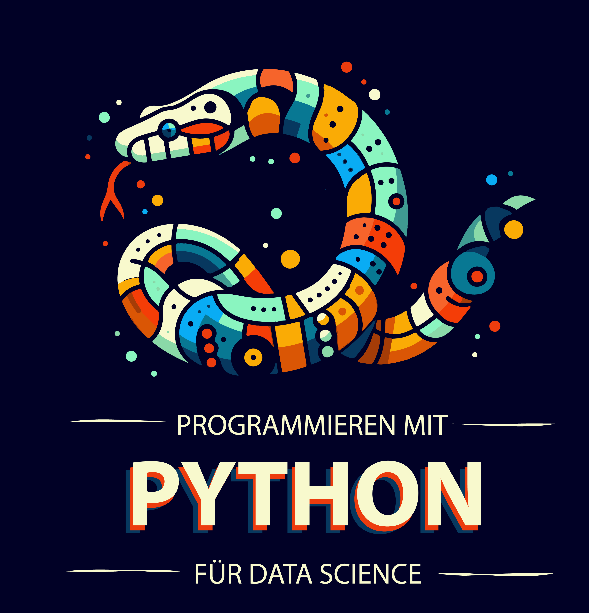

# Einführung Programmieren mit Python für Data Science

**Florian Huber**

Düsseldorf University of Applied Sciences (HSD)  
& Centre for Digitalization and Digitality (ZDD)

**v0.1** 2024-09-016

**Über mich:**
Ich arbeite als Professor für Data Science an der [Hochschule Düsseldorf (HSD)](https://www.hs-duesseldorf.de/). Dort bringe ich Studierenden die Grundlagen von Data Science,  Programmieren mit Python, Machine Learning bei oder gebe ungefragten Rat zu Kaffee, Schokolade, und allen anderen Dingen die wirklich wichtig sind im Leben.

Ich bin auch zu finden auf Mastodon: [mastodon.online/@me_datapoint](https://mastodon.online/@me_datapoint) sowie [GitHub](https://github.com/florian-huber).

This book is licensed under the [Creative Commons Attribution-NonCommercial-ShareAlike 4.0 International License](http://creativecommons.org/licenses/by-nc-sa/4.0/).